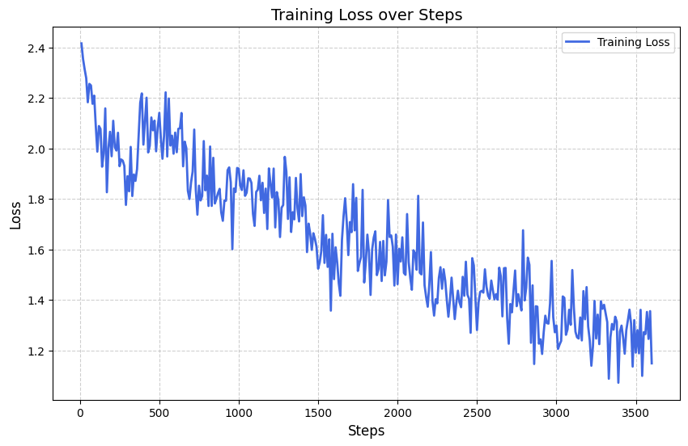
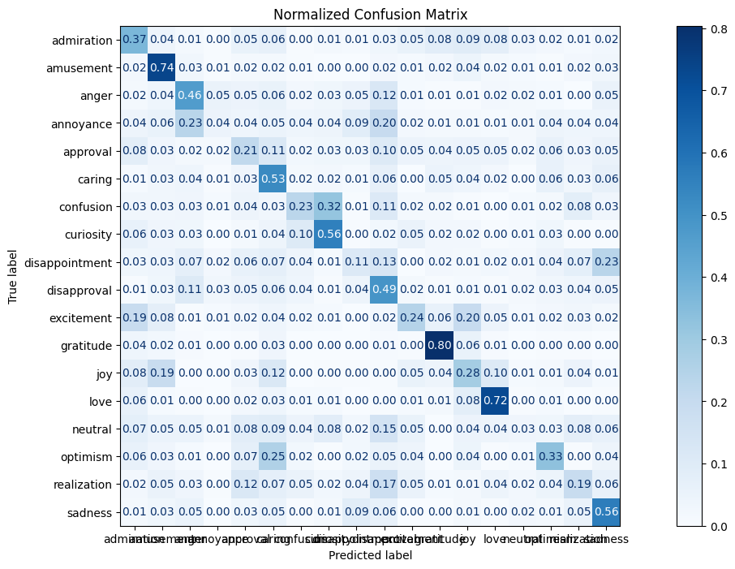

# Emotion Recogniser

A fine-tuned emotion classification model based on the GoEmotions dataset that can detect multiple emotions from text.

## Project Overview

This project fine-tunes the `sentence-transformers/all-MiniLM-L6-v2` model for multi-class emotion classification. The notebook implements the complete pipeline from data preprocessing to model evaluation.

## Dataset

**GoEmotions Dataset** - A corpus of Reddit comments labeled for 27 emotion categories (plus neutral), created by Google Research.

- **Source**: [Google Research GoEmotions](https://github.com/google-research/google-research/tree/master/goemotions)
- **Total samples used**: 18,000 comments (after preprocessing and balancing)
- **Emotion categories**: 18 emotions selected after filtering
- **Preprocessing steps**:
  - Combined 3 CSV files (`goemotions_1.csv`, `goemotions_2.csv`, `goemotions_3.csv`)
  - Removed duplicates based on text, author, and subreddit
  - Filtered emotions with at least 1,000 samples
  - Balanced dataset to 1,000 samples per emotion class
- **Data split**: Training 11,520 (64%) | Validation 2,880 (16%) | Test 3,600 (20%)

## Model Architecture

- **Base Model**: `sentence-transformers/all-MiniLM-L6-v2`
- **Task**: Multi-class sequence classification
- **Number of emotion classes**: 18 (filtered from original 28 categories)

## Training Configuration

- **Epochs**: 5
- **Batch size**: 16
- **Learning rate**: 5e-5
- **Optimizer**: AdamW
- **Evaluation**: Every 100 steps
- **Checkpointing**: Top 2 models saved

## Results

### Model Performance

The model achieved **39% overall accuracy** on the test set across 18 emotion categories. For context, random chance on 18 classes would be ~5.6%, making this a 7x improvement over baseline.

#### Classification Report (Test Set)

| Emotion | Precision | Recall | F1-Score | Support |
|---------|-----------|--------|----------|---------|
| admiration | 0.31 | 0.37 | 0.34 | 204 |
| amusement | 0.47 | 0.74 | 0.57 | 189 |
| anger | 0.39 | 0.46 | 0.42 | 198 |
| annoyance | 0.21 | 0.04 | 0.07 | 200 |
| approval | 0.20 | 0.21 | 0.21 | 174 |
| caring | 0.30 | 0.53 | 0.38 | 190 |
| confusion | 0.33 | 0.23 | 0.27 | 185 |
| curiosity | 0.49 | 0.56 | 0.52 | 209 |
| disappointment | 0.21 | 0.11 | 0.14 | 201 |
| disapproval | 0.28 | 0.49 | 0.36 | 197 |
| excitement | 0.35 | 0.24 | 0.29 | 194 |
| **gratitude** | **0.69** | **0.80** | **0.74** | 214 |
| joy | 0.28 | 0.28 | 0.28 | 204 |
| **love** | **0.61** | **0.72** | **0.66** | 202 |
| neutral | 0.14 | 0.03 | 0.06 | 204 |
| optimism | 0.45 | 0.33 | 0.38 | 212 |
| realization | 0.28 | 0.19 | 0.22 | 212 |
| sadness | 0.44 | 0.56 | 0.50 | 211 |

**Overall Metrics:**
- **Accuracy**: 39%
- **Macro Average**: Precision 0.36, Recall 0.38, F1-Score 0.36
- **Weighted Average**: Precision 0.36, Recall 0.39, F1-Score 0.36

### Key Insights
- **Best performing emotions**: Gratitude (F1: 0.74) and Love (F1: 0.66) are most reliably detected
- **Challenging emotions**: Neutral (F1: 0.06), Annoyance (F1: 0.07), and Disappointment (F1: 0.14) are hardest to classify
- The model tends to have higher recall than precision, meaning it catches more instances but with more false positives

### Example Prediction

```python
text = "you are an embarrassment"
# Predicted: sadness (Confidence: 41.99%)
```

### Visualizations

#### Training Loss Curve
The model shows steady convergence during training:



#### Confusion Matrix
Normalized confusion matrix showing the model's classification performance across all emotion categories:



The confusion matrix reveals which emotions are commonly confused with each other, helping identify areas for model improvement.

## Model Files

> **Note**: The trained model weights and checkpoints are **not included in this repository** due to file size constraints. 
> 
> To use this project:
> 1. Run the notebook to train your own model
> 2. The trained model will be saved locally in `emotion-classifier-model/` directory
> 3. Checkpoints are saved in `emotion-classifier/` during training

## Dependencies

Key Python packages used:
- `transformers` - Hugging Face transformers for model training
- `datasets` - Data handling and preprocessing
- `sentence-transformers` - Pre-trained sentence embeddings
- `evaluate` - Metrics computation
- `torch` - PyTorch backend
- `scikit-learn` - Data splitting and metrics
- `pandas` - Data manipulation
- `numpy` - Numerical operations
- `matplotlib`, `seaborn` - Visualization

## Notebook Structure

The [emotion_classifier.ipynb](emotion_classifier.ipynb) notebook follows this workflow:

1. **Data Acquisition**: Download GoEmotions dataset from Google Cloud Storage
2. **Data Preprocessing**: Clean, filter, and balance the dataset
3. **Exploratory Data Analysis**: Visualize emotion distribution
4. **Dataset Preparation**: Encode labels, tokenize text, create train/val/test splits
5. **Model Training**: Fine-tune the transformer model with Hugging Face Trainer
6. **Evaluation**: Generate confusion matrix and classification report
7. **Visualization**: Plot training loss and model performance
8. **Inference**: Create prediction function for emotion detection
9. **Model Export**: Save trained model and tokenizer

## How to Use

### Training the Model

1. Open [emotion_classifier.ipynb](emotion_classifier.ipynb) in Jupyter or Google Colab
2. Run all cells sequentially to:
   - Download the GoEmotions dataset
   - Preprocess and balance the data
   - Train the model
   - Generate evaluation metrics and visualizations
3. The trained model will be saved locally in `emotion-classifier-model/` directory

### Using the Trained Model

After training, you can use the model for predictions:

```python
from transformers import AutoTokenizer, AutoModelForSequenceClassification
import torch

# Load your trained model
model = AutoModelForSequenceClassification.from_pretrained("emotion-classifier-model")
tokenizer = AutoTokenizer.from_pretrained("emotion-classifier-model")

# Set device
device = torch.device('cuda' if torch.cuda.is_available() else 'cpu')
model = model.to(device)

def predict_emotion(text):
    inputs = tokenizer(text, return_tensors="pt", truncation=True, padding=True)
    inputs = {k: v.to(device) for k, v in inputs.items()}
    
    with torch.no_grad():
        outputs = model(**inputs)
        probabilities = torch.softmax(outputs.logits, dim=1)
        prediction = torch.argmax(probabilities, dim=1).item()
        confidence = probabilities[0][prediction].item()
    
    return prediction, confidence

# Example
prediction, confidence = predict_emotion("I'm so grateful for your help!")
print(f"Predicted class: {prediction}, Confidence: {confidence:.2%}")
```

## Project Structure

```
.
├── emotion_classifier.ipynb          # Main training notebook
├── README.md                          # Project documentation
├── loss_convergence.png              # Training loss visualization
├── confusion_matrix.png              # Normalized confusion matrix
├── .gitignore                        # Git ignore rules
└── data/
    └── full_dataset/                 # GoEmotions dataset files
        ├── goemotions_1.csv
        ├── goemotions_2.csv
        └── goemotions_3.csv
```

**Note**: The following directories are generated locally during training but not included in the repository:
- `emotion-classifier/` - Training checkpoints
- `emotion-classifier-model/` - Final trained model weights

## Future Improvements

Potential enhancements to consider:
- Experiment with more larger pre-trained models (e.g., BERT-base, RoBERTa)
- Implement data augmentation techniques to check what works and why
- Add support for multi-label emotion classification (may be i am not sure about this)
- Deploy as a REST API or web application (if i found a best and more strong method to classify the sentiments)

## References

- [GoEmotions: A Dataset of Fine-Grained Emotions](https://arxiv.org/abs/2005.00547)
- [Sentence-BERT: Sentence Embeddings using Siamese BERT-Networks](https://arxiv.org/abs/1908.10084)
- [Hugging Face Transformers Documentation](https://huggingface.co/docs/transformers/)
